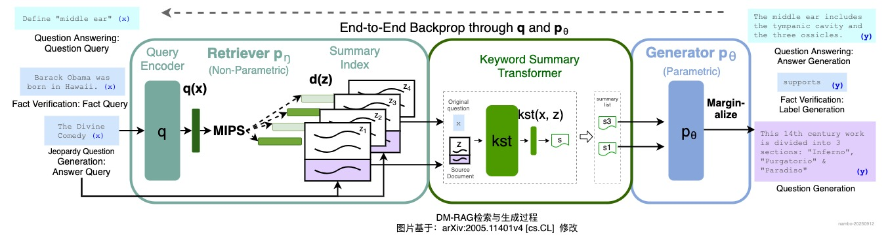

# Data Menu RAG: 一种基于动态知识摘要的新型检索增强生成框架

## 摘要
随着OpenAI于2025年2月推出*Deep Research（专业级研究报告生成智能体）*，基于大模型的*deep researcher*逐渐成为热门研究方向。传统检索增强生成（简称：RAG）方案，在实时性、多源信息整合等方面无法满足*deep researcher*的需求，因此在该领域应用有限。

本文提出一种新的RAG框架——Data Menu RAG（简称：DM-RAG），该框架针对传统RAG的知识库构建和检索生成阶段的局限性，进行了创新性的改进。在知识库构建阶段，摒弃了传统的预定义文档分块，改进为关键词摘要生成机制，在检索阶段采用多查询衍生与摘要融合策略，大幅提升了面向实时、复杂信息场景的处理能力。

下面将从RAG技术基础出发，阐述DM-RAG的核心原理、适用场景、优势与局限，并补充技术实现细节、性能评估等关键信息，为构建大模型智能体提供新的解决方案。

## 1. 什么是RAG？

检索增强生成（Retrieval-augmented Generation），简称RAG，是一种将**信息检索技术**与**大语言模型**结合人工智能框架，由FAIR团队于2020年提出，是当下热门的大模型前沿技术之一。其核心思想是：根据用户提出的问题，首先从外部知识库中检索相关资料，再将检索到的资料与用户问题一起输入大模型，进而输出更加准确、可靠的回答。


RAG系统通常包含下面三个核心组件：

- **知识库（Knowledge Base）**：从外部收集各类数据，经过结构化及预处理（清洗、分块、向量化），保存到向量数据库中；
- **检索器（Retriever）**：从知识库中查找与输入相关的文档或段落，常用技术包括：密集检索（如DPR）、稀疏检索（如BM25）、混合检索等；
- **生成器（Generator）**：使用大语言模型（如GPT、LLaMA等），接收检索结果和用户输入，生成最终的回答。

通过RAG技术，能够显著提升大模型回答的准确性、减少“幻觉”、高效整合私有知识，并且成本低效率高，因此在智能问答、在线客服、报告生成等场景有非常广泛的应用。

## 2.传统RAG的局限性？

传统RAG技术虽显著提升了大模型回答的准确性和可靠性，但其内在局限性在复杂实际场景中日益凸显，主要表现为：**信息损失**不可控、**多源信息整合**困难、信息**实时性**差。

#### 信息损失

传统RAG在知识库构建阶段，需要对原始文档进行*文本分块*和再进行*向量化压缩*，这种方式存在**上下文断裂**（断章取义、前后颠倒等）、**细节丢失**（章节标题、备注等）、**元信息剥离**（作者、时间、标题、术语等）等问题，例如这段内容：

> **01.盈利仍然遥遥无期**
>
> 第四范式将自己定位为“以平台为中心的决策类人工智能提供商”，在决策类人工智能赛道中，第四范式的市场占有率居于首位。
>
> 尽管如此，第四范式仍严重缺乏“造血能力”。根据招股书及财报，2021年至2023年，第四范式的总营收分别为20.18亿元、30.83亿元和42.04亿元，净亏损分别为18.02亿元、16.53亿元和9.21亿元。
>
> 引用自：[营收增速持续放缓，第四范式难解困局](https://hk.jrj.com.cn/2024/11/30105645877965.shtml)

经过分块后可能被分成如下三块：

> 1. 01.盈利仍然遥遥无期

> 2. 第四范式将自己定位为“以平台为中心的决策类人工智能提供商”，在决策类人工智能赛道中，第四范式的市场占有率居于首位。

> 3. 尽管如此，第四范式仍严重缺乏“造血能力”。根据招股书及财报，2021年至2023年，第四范式的总营收分别为20.18亿元、30.83亿元和42.04亿元，净亏损分别为18.02亿元、16.53亿元和9.21亿元。

如果问题为“第四范式人工智能业务的经营情况”，那么大概率检索出2，生成正面评价的回答，与原文的观点完全相背。

对于简单的文档，可以通过**滑动窗口检索（Sliding Window Retrieval）**、**重排序（ReRanker）**、**ChunkSize**、**切割算法**等方式缓解上述问题，但当文档结构复杂时（如年报、企业研报等），效果非常有限。

#### 多源信息整合

传统的RAG方案，会将不同语言、格式、描述主体、来源的文档，分割后混合存储在向量库中，当知识库中的文档上述维度有较大差异时，会出现下列问题：

- **主体紊乱**：检索一个对象的相关信息时，可能会拿到描述其他对象的文档块。

  例如：下面是 `《商汤科技25年中报》` 的一段内容。

  > 我們的收入由截至2024年6月30日止六個月的人民幣1,739.7百萬元上升35.6%至 截至2025年6月30日止六個月的人民幣2,358.2百萬元，主要由於生成式AI持續增長。

  当问题为 `第四范式2025年收入情况？` 时，上面的段落有可能会被检索出来，在回答时错误的把`商汤`的收入当成`第四范式`的收入。

- **信息泛滥**：当知识库中文档数量逐渐变多时，会产生大量文档分块，进而引起向量搜索的质量变差，具体表现为：低召回率（与输入相关的重要信息未搜索到）、低准确率（搜索结果中包含大量无关信息），导致最终生成回答质量很低。

- **模态割裂**：对于非文本格式的数据如：表格、图片、视频等，无法很好的支持。

在一般的RAG系统中，通常使用**追加元信息**、**实体约束**、**混合检索**、**语义分块**等方式缓解上述问题，但是当文档规模和差异进一步提升时，效果往往不尽人意。

#### 3.3 实时性

在传统的RAG方案中，需要拿到所有信息的完整文档，并主义分割、向量化、保存，在消耗大量资源的同时，知识库的时效性也比较差，通常是以T+1为主。目前大部分Deep Researcher场景，对信息的实时要求均比较高，因此传统的RAG方案无法支撑。

## 3. 什么是Data Menu RAG？

Data Menu RAG（简称DM-RAG）是一种新型RAG架构，它在传统RAG的的两个关键阶段进行改进，解决了传统RAG存在的信息损失、多源信息整合、实时性等方面的局限性。

#### 3.1 知识库构建阶段


与传统RAG直接**获取原始文档进行切割分块**不同，DM-RAG的知识库构建过程，采用了一种**关键字动态知识摘要**的方法：

1. **关键字生成**：根据问题，生成与问题相关的搜索关键字列表；
2. **搜索**：使用关键字分别在互联网进行信息搜索，记录搜索结果；
3. **信息摘要**：根据关键字和搜索结果，生成信息摘要。通常互联网搜索结果中已经具备无需额外生成，但是对于表格、图片等非文本格式信息，通常需要进行摘要；
4. **字典构建**：根据信息摘要、详情地址及其他文档元信息，将搜索结果逐一转换为数据字典；
5. **向量存储**：将数据字典进行Embedding并保存到向量库中。

这种方式的好处包括但不限于：

- **无切割**：不会对文档进行分块，能够最大程度保障信息的完整性，有效的避免信息损失、主体紊乱等问题。并且文档只会在向量库中保存一条相关的摘要，也能够有效的防止信息泛滥；
- **多模态**：借助大模型的多模态能力，可以有效的实现对表格、图片等非文本数据处理和引用；
- **实时性**：互联网搜索结果通常会包含关键字摘要，因此往往仅需进行一次搜索，无需获取结果的详情信息，这大幅减少了网络请求耗时。另外去除了分割并减少了向量化存储内容，执行速度进一步提升。因此能够确保知识库构建的实时性。

#### 3.2 检索与生成阶段



检索阶段是目前RAG主流优化的重点，在这个阶段与传统RAG无太大差别，且相关优化方案大多也适用于DM-RAG，包括但不限于：重排序（Re-ranking）、意图识别（Intent Recognition）、查询衍生（Query Generation/Query Expansion）、实体链接（Entity Linking）、多阶段检索（Multi-Stage Retrieval）等等。

改进主要集中在生成阶段，传统RAG方案是基于文档块和输入问题生成回答。而DM-RAG采用的是**动态知识摘要融合**策略。

DM-RAG检索与生成过程大致为：

1. **查询衍生**：基于原始问题，自动衍生出多个待查询的问题；
2. **并行检索**：在向量库中同时检索所有问题；
3. **相关性检测**：评估检索结果与问题的相关性，过滤低相关性内容；
4. **详情获取与摘要生成**：获取字典项的详情（可能是文字、图片等），根据问题动态生成知识摘要（同一文档会根据不同问题生成多视角的摘要）；
5. **生成回答**：根据摘要列表和原始问题，生成回答内容。

这么做的好处包括但不限于：

- **语义完整**：通过知识摘要，而不是文档分块，确保引用的信息语义完整；
- **消除语义鸿沟**：通过问题衍生拓展问题语义，通过多角度知识摘要拓展数据语义，再将两者相结合，可以有效的避免语义鸿沟；
- **避免噪声**：通过相关性检测和知识摘要，可以过滤掉绝大部分噪声干扰。

## 4. 技术实现细节

与传统RAG一样，DM-RAG也是采用两段式结构，包括：**知识库构建**、**检索与生成**。

> [!CAUTION]
>
> 本章节所提供代码仅为示例，无法直接运行，需根据实际场景完善补充细节

#### 4.1 知识库构建

DM-RAG的知识库构建过程涉及多个关键节点，其核心代码如下：

```python
class DataMenuRAGBuilder:
    def __init__(self, embedding_model="text-embedding-v2"):
        self.embedding_model = DashScopeEmbeddings(model=embedding_model)
        self.vector_store = Milvus(
            embedding_function=self.embeddings,
            connection_args={
                "uri": os.environ['zilliz_milvus_url'],
                "token": os.environ['zilliz_milvus_token'],
                "db_name": os.environ['zilliz_milvus_db_name']
            }
        )
    
    def generate_search_queries(self, base_question):
        """基于基础问题生成搜索查询"""

        # prompt仅为示例
        prompt = """
        根据以下问题生成下述6个方面的搜索关键词：
        问题：{question}
        要求：关键词应覆盖问题的主要方面，包括领域/方向、主体/对象、依赖/原料、方法/技术、政策/法规、路径/工具等
        """
        # 使用LLM生成搜索关键词
        response = llm.invoke(prompt.format(question=base_question))
        return self.parse_keywords(response)
    
    def web_search_and_summarize(self, keywords):
        """网络搜索并生成摘要"""
        menus = []
        for keyword in keywords:
            # 执行网络搜索
            search_results = web_search(keyword, max_results=3)
            
            for result in search_results:
                # 先尝试获取搜索结果中的摘要
                summary = result['summary']
                # 如果结果没有摘要或是非文本格式，则使用LLM生成摘要
                if summary is None or summary == '' or result['type'] != 'text':
                    # 生成针对性摘要
                    summary_prompt = """
                    为关键词'{keyword}'生成简短摘要（100-150字），包含：
                    1. 核心概念定义
                    2. 主要特点或属性
                    3. 常见应用场景
                    4. 来源可靠性评估
                    
                    内容：{content}
                    """
                    summary = llm.invoke(summary_prompt.format(
                        keyword=keyword, content=result['content']
                    ))
                
                menus.append({
                    'title': result['title'],
                    'keyword': keyword,
                    'summary': summary,
                    'source_url': result['url'],
                    'original_content': result['content'][:500] + "..."  # 保留部分原文
                })
        return menus
    
    def build_knowledge_base(self, base_question):
        """构建知识库"""
        keywords = self.generate_search_queries(base_question)
        menus = self.web_search_and_summarize(keywords)
        
        # 向量化并存储
        documents = [
            Document(
                page_content=json.dumps(item, ensure_ascii=False),
                metadata={
                    'keyword': item['keyword'],
                    'source_url': item['source_url'],
                    'original_content': item['original_content']
                }
            ) for item in menus
        ]
        self.vector_store.add_documents(documents)
        return menus
```

#### 4.2 检索与生成

该阶段主要采用多查询衍生和动态知识摘要融合策略，主要代码如下：

```python
class DataMenuRAGRetriever:
    def __init__(self, vector_store, llm_model="qwen3-235b-a22b"):
        self.vector_store = vector_store
        self.llm = ChatTongyi(model=llm_model, model_kwargs={ 'enable_thinking': False })
    
    def derive_sub_questions(self, main_question):
        """衍生子问题"""
        prompt = """
        将以下复杂问题分解为3-5个子问题：
        主问题：{question}
        
        要求：
        1. 每个子问题应关注主问题的不同方面
        2. 子问题应具有可检索性
        3. 覆盖技术实现、应用场景、优缺点等方面
        """
        response = self.llm.invoke(prompt.format(question=main_question))
        return self.parse_sub_questions(response)
    
    def retrieve_and_summarize(self, sub_questions):
        """检索并生成摘要"""
        sub_question_summaries = []
        
        for sub_q in sub_questions:
            # 检索相关文档
            retrieved_docs = self.vector_store.similarity_search(sub_q, k=3)
            
            # 生成子问题摘要
            summary_prompt = """
            基于以下检索信息，为子问题生成摘要：
            子问题：{question}
            
            检索信息：
            {context}
            
            摘要要求：
            1. 长度150-200字
            2. 包含关键事实和数据
            3. 注明信息来源
            4. 评估信息可靠性
            """
            context = "\n\n".join([doc.page_content for doc in retrieved_docs])
            summary = self.llm.invoke(summary_prompt.format(
                question=sub_q, context=context
            ))
            
            sub_question_summaries.append({
                'sub_question': sub_q,
                'summary': summary,
                'source_documents': retrieved_docs
            })
        
        return sub_question_summaries
    
    def generate_final_answer(self, main_question, sub_question_summaries):
        """生成最终答案"""
        summaries_text = "\n\n".join([
            f"## {item['sub_question']}\n{item['summary']}" 
            for item in sub_question_summaries
        ])
        
        final_prompt = """
        基于以下子问题摘要，生成对主问题的全面回答：
        
        主问题：{question}
        
        子问题摘要：
        {summaries}
        
        回答要求：
        1. 结构清晰，分部分回答
        2. 包含具体数据和事实
        3. 注明信息出处
        4. 评估不同观点的可靠性
        5. 如有不确定性，明确说明
        6. 字数800-1000字
        """
        
        response = self.llm.invoke(final_prompt.format(
            question=main_question,
            summaries=summaries_text
        ))
        return response

    def generate(self, main_question):
        """进行检索和生成"""
        # 1. 问题衍生
        sub_questions = self.derive_sub_questions(main_question)
        # 2. 检索与动态摘要
        sub_question_summaries = self.retrieve_and_summarize(sub_questions)
        # 3. 生成回答
        response = self.generate_final_answer(main_question, sub_question_summaries)
        return response
```

## 5. 适用哪些场景？

如上文所述，DM-RAG相较于传统RAG方案，其**信息损失**、**多源信息整合**、**实时性**有大幅的改进，特别适合以下场景：

#### 5.1 复杂问题求解

当问题涉及多领域或需要综合多种数据源时，DM-RAG的表现会明显优于传统RAG，例如：

- **综合调研报告**：从多个角度分析某个行业、产品等的市场调用报告；
- **方案对比选型**：从不同维度，分析对比多种方案的优劣势的决策支持场景；
- **数据分析报告**：从统计、趋势、影响等多个维度，分析数据并给出指导性意见的数据分析报告。

#### 5.2 信息实时变化的领域

在知识更新频繁，对信息时效性要求高的领域，DM-RAG可以提供更好的时效性，例如：

- **实时资讯整合**：新闻事件、市场动态等实时性要求高的场景；
- **新型技术研究**：对于刚刚兴起或处于快速发展阶段的技术，如：人工智能、区块链等，进行深度研究；
- **政策规定解读**：经常变动的法律法规、政策文件及内部规定的解读。

#### 5.3 准确性要求高的场景

对于信息准确性要求极高的场景中，DM-RAG通过**动态知识摘要融合**，可以确保信息的完整性和准确性，例如：

- **医疗诊断支持**：症状分析、药物的相互作用等医疗健康分析；
- **金融投资领域**：投资价值、风险评估、市场分析等金融应用；
- **学术研究辅助**：文献综述、学术思路生成等学术研究场景。

> [!NOTE]
>
> 如果有需要，可以通过邮件联系我：nambo@foxmail.com

