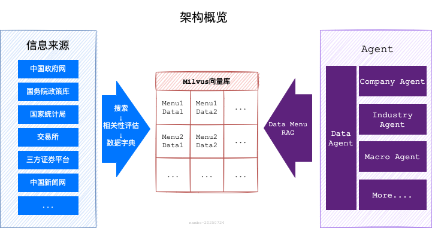
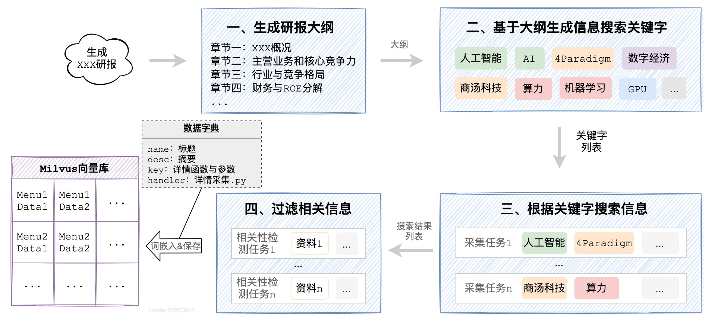
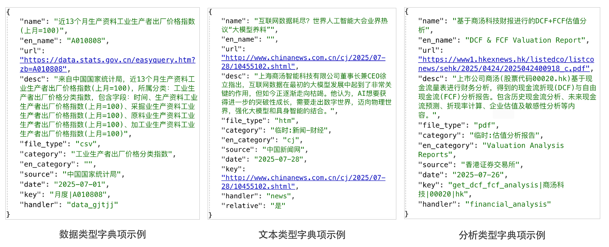
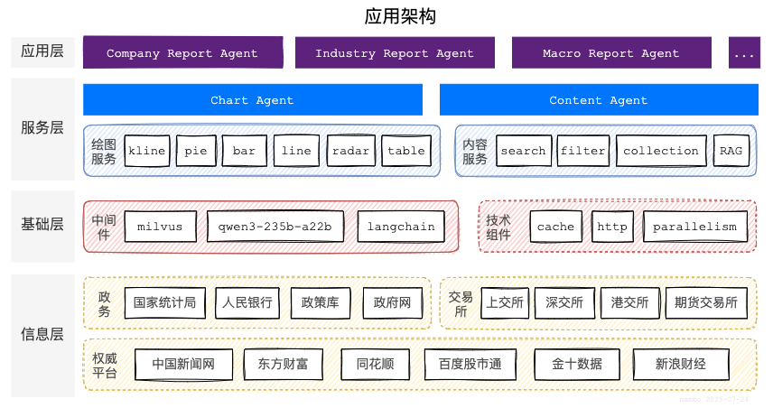
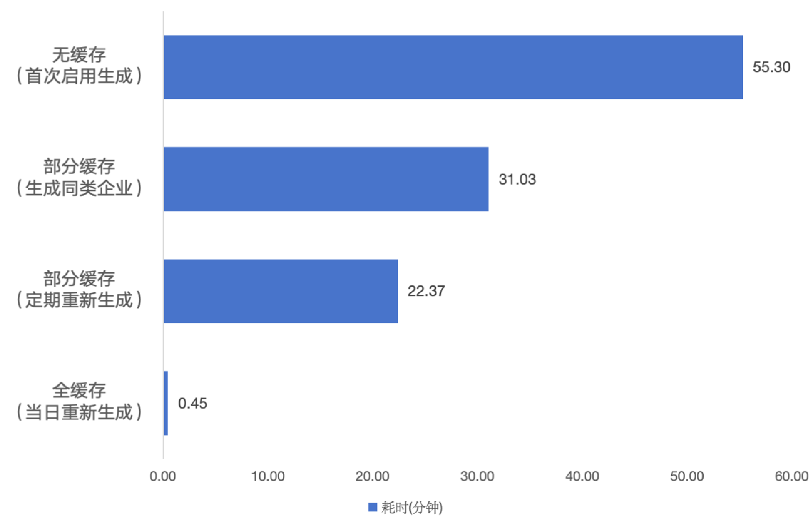
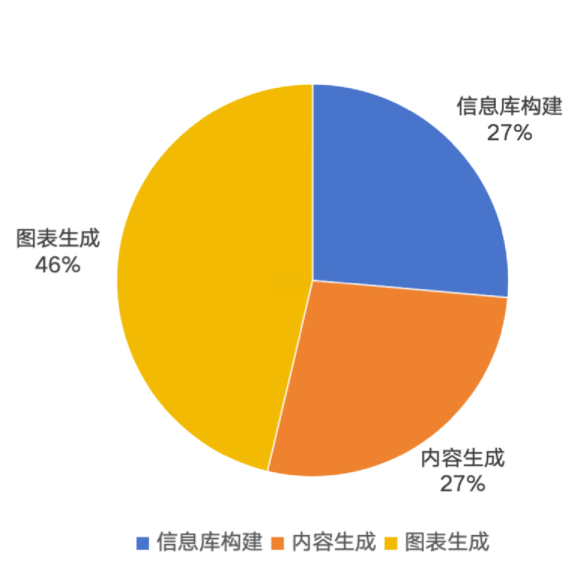
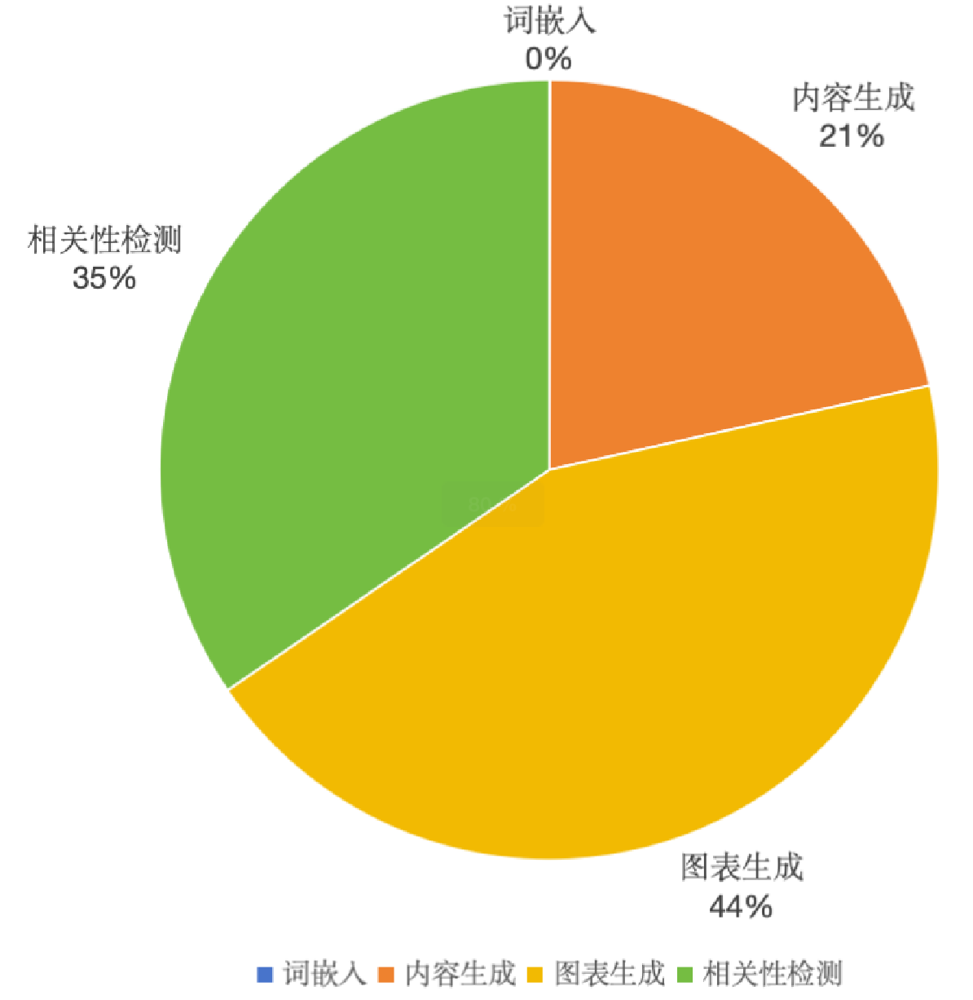

# Menu RAG：金融多模态报告自动化生成智能体

<p align="center">
  <i>Beyond Basic RAG, Empowering Real-Time Deep Research</i>
</p>

<p align="center">
    <a href="https://github.com/nambo/menu-rag/releases">
        
    </a>
    <a href="https://www.python.org/">
        
    </a>
    <a href="https://github.com/nambo/menu-rag/blob/master/LICENSE">
        
    </a>
</p>

<h4 align="center">
    <p>
        <a href="#一架构设计-framework">架构设计</a> |
        <a href="#二项目目录-filetree">目录结构</a> |
        <a href="#三开发环境-env">开发环境</a> |
        <a href="#四运行指南-manual">运行指南</a> |
        <a href="#五部署-deploy">本地部署</a> |
        <a href="#六迭代过程-history">迭代过程</a> |
    <p>
</h4>

本项目是天池比赛AFAC2025大赛，获得三等奖的参赛项目代码，也是Data Menu RAG（或称DM-RAG）方案的示例代码。

比赛信息详见： <a href="https://tianchi.aliyun.com/competition/entrance/532354/information" target="_blank">AFAC2025挑战组-赛题四：智能体赋能的金融多模态报告自动化生成</a>

参赛队伍：`队伍名字不能为空`                                                 作者：nambo                                             时间：2025-09-11

> [!NOTE]
>
> 如果有需要，可以通过邮件联系我。nambo@foxmail.com


## 一、架构设计 {#framework}

### 1.1 简介

近些年，随着人工智能相关技术的突飞猛进，金融科技正经历前所未有的变革。金融研究报告（研报）因其专业性高、涉及内容广泛，一直金融领域的核心产出。随着“大模型”的日益强大，以及相关配套生态的逐渐完善，构建基于大模型的Agent，成为大模型应用的主流方向。

本方案是“2025金融智能创新大赛”的参赛项目，目标是基于大模型及Agent相关技术，构建自动化智能体，完成研报的信息收集、内容生成、图表绘制等工作，自动生成金融研报。目前已经完成基础架构设计和MVP开发，基于MVP版本能够完成数万字的个股、行业、宏观研报的编制工作，在上述创新大赛相关赛题中，荣获三等奖。

该方案中设计的智能体架构，具备较好的生成效率及灵活的拓展能力。除了赛题指定的三个场景以外，通过新数据引入和简单的提示词调整，即可完成新场景研报智能体构建，在金融研报领域具备较好的应用前景。

### 1.2 架构方案

#### 1.2.1 Data Menu RAG介绍
本方案创新性的提出并使用了Data Menu RAG（简称DM-RAG），这是一种新型RAG架构，它在传统RAG的的两个关键阶段进行改进，解决了传统RAG存在的信息损失、多源信息整合、实时性等方面的局限性，相较于传统RAG方案，主要改进点如下：

1. **知识库构建阶段**：与传统RAG直接**获取原始文档进行切割分块**不同，DM-RAG的知识库构建过程，采用了一种**关键字动态知识摘要**的方法。

大致过程为：`关键字生成` → `搜索` → `信息摘要` → `字典构建` → `向量存储`。
这样做的优势在于：
    - **无切割**：不会对文档进行分块，能够最大程度保障信息的完整性，有效的避免信息损失、主体紊乱、信息泛滥等问题；
    - **多模态**：借助大模型的多模态能力，可以有效的实现对表格、图片等非文本数据处理和引用；
    - **实时性**：搜索结果通常包含摘要，因此往往仅需搜索无需获取详情，大幅减少了网络请求次数与耗时，提升知识库构建的实时性。

2. **生成阶段**：传统RAG方案是基于检索到的文档块和输入问题生成回答，而DM-RAG采用的是**动态知识摘要融合**策略。
   
   大致过程为：`问题衍生` → `并行检索` → `相关性检测` → `详情获取与摘要生成` → `生成回答`。
   这么做的好处包括：
    - **语义完整**：通过知识摘要，而不是文档分块，确保引用的信息语义完整；
    - **消除语义鸿沟**：通过问题衍生拓展问题语义，通过多角度知识摘要拓展数据语义，再将两者相结合，可以有效的避免语义鸿沟；
    - **避免噪声**：通过相关性检测和知识摘要，可以过滤掉绝大部分噪声干扰。

关于DM-RAG的详细介绍，你可以阅读这篇文章：[Data Menu RAG: 一种基于动态知识摘要的新型检索增强生成框架](https://github.com/nambo/menu-rag/blob/main/DM_RAG.md)

#### 1.2.2 架构设计

在金融研报这类深度研究场景，为了保障内容丰富度和信息全面性，往往需要整合数以千计资料和数据，同时还涉及对特定数据的专业建模分析。目前主流的方案是基于RAG技术，将原始资料/数据根据语义进行分割，创建向量索引后分块存储，然后基于特定问题进行向量检索到信息块，最后再做归纳汇总。

这种方案不适用于**DeepResearcher**场景，主要问题在于文档的采集与分割过程，不仅会消耗大量计算资源和时间，还会存在不可控的信息损失，导致最终生成效率很低、效果较差。因此，本方案创新性的采用了“Data Menu RAG”技术实现，如下图：



过程一：**知识库构建**

其中，信息搜索、采集与知识库构建过程如下：

1. **生成研报大纲**：基于问题生成研报的所有章节标题及内容提示；
2. **生成信息搜索关键字**：根据研报的大纲，生成需要在互联网进行信息搜索的关键字；
3. **信息搜索**：使用关键字，并行在互联网搜索信息；
4. **相关性检测与字典构建**：并行检测搜索到的结果与原始问题、大纲的相关性，过滤无关信息，并获取摘要转换为数据字典结构；
5. **向量存储**：将字典内容向量化，并构建元数据，存储到向量库中。



知识库中保存了如下的数据：



过程二：**检索与生成**

在完成资料库构建后，将基于大纲逐一生成每个章节的内容，内容生成过程如下：

1. **问题衍生**：基于章节的内容，衍生出多个待检索的问题；
2. **检索与相关性检测**：基于生成的问题，并行检索，并检测过滤与章节无关结果；
3. **详情采集与摘要**：根据检索到的相关字典项，采集对应的详情，并生成与章节内容相关的摘要；
   - 如果是分析类型字典，还会调用对应的专业分析函数，生成专业分析报告；
4. **章节内容生成**：根据章节内容提示，结合生成的摘要清单，融合生成章节内容并标注引用。


**应用架构**

基于上述Data Menu RAG的基本思想，最终构建了多层级的多Agent架构，如下图所示：



从下往上共分为4个层级，分别是：

- **信息层**：采集统计局、人行、国务院、交易所等官方权威平台数据，为研报生成提供高质量数据支撑；
- **基础层**：采用最新的高性能组件，为高效率生成提供技术保障；
- **服务层**：采用MCP协议，构建了绘图、数据（或称为内容）两大基础Agent；
- **应用层**：可以根据使用场景，通过简单的提示词调整，灵活配置不同的Agent。

#### 1.2.3 创新点

1. **基于数据字典的增强检索生成（Data Menu RAG）技术**
   创新的提出“基于数据字典的增强检索”技术，解决了传统RAG技术，在公开信息研报场景，存在的速度慢、资源消耗高、信息损失等问题，研报生成效率和质量大幅提升。
2. **多级缓存与“断点重试”**
   免费数据源稳定性较差，在大模型会话、数据源获取等关键点设置了多层级的缓存。出现异常时，会自动清理异常缓存，回滚至最近成功点重新继续执行，确保100%成功生成研报，且单篇研报最低仅需消耗30万Token左右。
3. **并行生成**
   在内容数据采集、图表绘制等耗时大的节点，实现了多任务并行生成。在调高并行度且命中大量缓存的情况下，最快10分钟左右可完成研报生成。
4. **数据接入**
   开发了一套数据接入规范，按照约定的数据字典结构，实现2个标准函数（出入参格式、函数名），即可快速接入新的数据源，用于研报生成。
5. **场景拓展**
   采用多层agent架构，服务层Agent已封装通用基础能力，通过应用层Agent简单的提示词调整，即可灵活、便捷的实现新场景拓展。

#### 1.2.4 效果

- **研报质量**：凭借该方案构建mvp版本生成的研报，在AFAC2025比赛中，获得了三等奖；

- **生成速度**：最快10min即可生成一篇研报，进行进一步优化，有希望实现秒级的万字研报生成。不同场景生成速度及不同阶段耗时如下：
<p align="center">
  
  
</p>

- **资源消耗**：最少只需要30wtoken即可生成一篇。不同场景及不同阶段消耗token如下：
<p align="center">
  
  
</p>

## 二、项目目录 {#filetree}
```
├── agent/                             # agent实现
│   │── common/                            # 基础工具
│   │   ├── llm_utils.py                       # 大模型调用工具
│   │
│   │── agent_chart.py                     # 绘图agent
│   │── agent_data.py                      # 数据管理agent
│   │── agent_industry.py                  # 行业报告agent
│   │── agent_macro.py                     # 宏观经济报告agent
│   │── agent_stock.py                     # 个股/企业agent
│ 
├── mcps/                              # mcp服务实现    
│   │── common/                            # 基础工具
│   │   ├── _cache/                            # 缓存保存目录（不建议频繁清理，定期清理一次过期缓存文件即可）
│   │   ├── _imgs/                             # 绘图结果保存目录
│   │   ├── fonts/                             # 绘图使用的字体
│   │   ├── cache.py                           # 缓存工具
│   │   ├── chart_utils.py                     # 绘图工具
│   │   ├── http_utils.py                      # 网络请求工具
│   │   ├── parallelism.py                     # 并行运算工具
│   │   ├── pdf_reader.py                      # pdf阅读工具
│   │   ├── util.py                            # 其他工具
│   │
│   │── spider/                            # 网络数据提取工具
│   │   ├── data_files/                        # 统计局工具下载临时目录
│   │   ├── hszs_files/                        # 恒生指数下载临时目录
│   │   ├── data_gjtjj.py                      # 国家统计局数据提取
│   │   ├── data_rmyh.py                       # 人民银行统计司数据提取
│   │   ├── financial_analysis.py              # 企业财务报表提取
│   │   ├── forex_akshare.py                   # 外汇数据
│   │   ├── futures_akshare.py                 # 期货数据
│   │   ├── index_hs.py                        # 恒生指数
│   │   ├── macro_akshare.py                   # 宏观经济数据
│   │   ├── news.py                            # 中国新闻网
│   │   ├── report_hk.py                       # 港交所
│   │   ├── report_sh.py                       # 上交所
│   │   ├── report_sz.py                       # 深交所
│   │   ├── stock_akshare.py                   # 股票数据（akshare）
│   │   ├── stock_bd.py                        # 股票数据（百度股市通）
│   │   ├── stock_xq.py                        # 股票数据（雪球）
│   │   ├── zhengce_gwy.py                     # 国务院政策文件库
│   │   ├── zhengce_rmzf.py                    # 政府网
│   │
│   │── tools/                             # 工具
│   │   ├── create_document.py                 # docx文件生成
│   │   ├── store.py                           # Milvus数据管理
│   │
│   │── data_types.py                      # 数据类型定义
│   │── server_chart.py                    # 绘图MCP服务
│   │── server_data.py                     # 数据管理MCP服务
│   │── server_news.py                     # 新闻MCP服务
│   │── server_policy.py                   # 政策与公共MCP服务
│   │── server_stock.py                    # 股票MCP服务
│   
├── results/                           # 结果目录
│   ├── Company_Research_Report.docx       # 公司研报
│   ├── Industry_Research_Report.docx      # 行业研报
│   ├── Macro_Research_Report.docx         # 宏观经济研报
│
├── config.py                          # 配置文件
├── main.py                            # 主文件（暂未使用）
├── prompts.py                         # 提示词配置文件
├── Readme.md                          # 项目说明
├── requirements.txt                   # python依赖包清单
├── run_company_research_report.py     # 生成企业研报脚本
├── run_industry_research_report.py    # 生成行业研报脚本
├── run_marco_research_report.py       # 生成宏观研报脚本
├── run.sh                             # 同时运行三个生成脚本
```


## 三、开发环境 {#env}

| 类型     | 名称        | 版本           | 备注 |
| -------- | ----------- | -------------- | ---- |
| 计算机   | MacBook Pro | 2018           |      |
| 操作系统 | MacOS       | 15.3.2 (24D81) | 非Docker部署建议使用Linux |
| 运行时   | Python      | 3.10.1         |      |
| 开发框架 | langchain   | 0.3.26         |      |
| 向量数据库 | Milvus | 2.5.x    | 使用zilliz云提供的免费服务 |
| 大模型 | 千问3 | qwen3-235b-a22b    | 使用百炼提供的免费额度 |

## 四、运行指南 {#manual}

本项目可以基于Docker或本地化运行，运行前请注意如下事项：

> 1. 注意当前为MVP（最小可行性）版本，仅支持单个逐篇生成，不支持同时运行多个进程同时生成多篇研报；
> 2. 生成过程中使用到百度股市通的数据，如果发现结果研报中未引用财务摘要、三大财务报告数据，可能是股市通token过期，可以参考本文档第五章节：本地部署指南，更新百度股市通的token，建议同时切换本地IP；
> 3. 因需要使用国家统计局等官方数据，建议生成过程中不要开启外网的VPN代理，否则可能会导致无法采集到相关数据；
> 4. 可以通过`config.py`中的`parallelism_count`配置，控制生成的并行数（默认5），数字越大并行程度越高，速度越快。但是要注意，加大并行度，会在影响采集和大模型调用的并发数，过大可能会导致外部平台或大模型平台异常；
> 5. 提交的比赛代码中已配置可使用的token和相关中间件配置信息，因资源有限仅可用于于评委组复现使用。

### 4.1 Docker运行

进入项目根目录，目录下的 `Dockerfile` 为docker镜像配置文件，可以用其构建docker镜像运行代码。

在根目录执行如下指令，即可基于docker生成研报：

#### 1. 修改配置

进入项目根目录，打开 `config.py` 文件，设置 `Milvus`、`阿里百炼平台`、`百度股市通` 相关配置。详见：

- [Milvus](#51-milvus)
- [阿里云百炼](#52-阿里云百炼)
- [百度股市通](#53-百度股市通)

#### 2. 执行下述指令

```
# 1. 拉取基础镜像
docker pull python:3.12-slim

# 2. 构建镜像(预计5分钟左右)
docker build -t tianchi-report-agent:1.0 .

# 3. 创建并启动容器
docker run -d --name tianchi-report-agent -v ./:/res/ --rm tianchi-report-agent:1.0

# 4. 跟踪生成日志（预计2~3小时可以完成）
docker logs -f tianchi-report-agent
```

执行完上述指令后，在当前目录下即生成了赛题要求的三份研报。

> `Company_Research_Report.docx`为企业研报，`Industry_Research_Report.docx` 为行业研报，`Macro_Research_Report.docx`为宏观研报

### 4.2 本地运行

#### 1. 修改配置

进入项目根目录，打开 `config.py` 文件，设置 `Milvus`、`阿里百炼平台`、`百度股市通` 相关配置。详见：

- [Milvus](#51-milvus)
- [阿里云百炼](#52-阿里云百炼)
- [百度股市通](#53-百度股市通)

#### 2. 运行下述指令

本项目需要`python3.10`以上的版本，可以通过一下指令，完成赛题要求的三大研报生成：

```
# 1.进入项目根目录
cd [你的项目保存路径]

# 2.安装依赖包
python -m pip install -r requirements.txt

# 3.启动`绘图mcp`服务
python mcps/server_stock.py

# 4.启动 `股票信息mcp` 服务
python mcps/server_stock.py

# 5.开始生成个股、行业、宏观研报（无缓存情况下，预计2~3小时左右）
sh run.sh
```

查看生成结果：生成结果保存在根目录下的`result`目录中

> `Company_Research_Report.docx`为个股研报
>
> `Industry_Research_Report.docx`为行业研报
>
> `Macro_Research_Report.docx`为宏观研报。

## 五、部署 {#deploy}

本项目基于python的langchain框架开发，依赖`Milvus向量数据库`及`qwen3-235b-a22b`模型，推荐使用Linux CentOS7部署（其他Linux发行版本也可以）。

#### 5.1 Milvus

本项目使用了zilliz免费提供的由阿里云托管的Milvus云服务，你可以通过下述步骤完成配置

1. 通过 <a href="https://market.aliyun.com/detail/cmgj00063418?spm=5176.21213303.J_ZGek9Blx07Hclc3Ddt9dg.1.13ab2f3dhVmZoH&scm=20140722.S_market@@????@@cmgj00063418._.ID_market@@????@@cmgj00063418-RL_zillizcloud-LOC_2024SPAllResult-OR_ser-PAR1_213e365517532953279014254efa51-V_4-RE_new10-P0_0-P1_0" target="_blank">阿里云：Zilliz Cloud</a> 申请免费实例。
2. 登录 <a href="https://cloud.zilliz.com.cn/orgs" target="_blank">Zilliz Cloud后台</a> 新建集群
3. 复制集群信息页面中的 `Endpoint` 和  `Token` 到项目配置文件 `config.py` 中的 `zilliz_milvus_url` 、 `zilliz_milvus_token` 、 `zilliz_milvus_db_name`字段，配置完成。

> 1. 提交的比赛代码中已配置可使用的库信息，因资源有限仅可用于于评委组复现使用
>
> 2. 你也可以选择私有化部署，具体过程详见：<a href="https://milvus.io/docs/zh/install-overview.md" target="_blank">Milvus官方部署手册</a>


### 5.2 阿里云百炼

本项目使用的模型为`qwen3-235b-a22b` 及 `text-embedding-v2`，千文系列是由阿里开发的大模型，其中千文3是其最新版本，`235b-a22b` 是当前阿里系列开源版本中参数规模较大的模型。

本项目使用 `阿里百炼平台` 提供的免费额度的API服务，你可以通过下述步骤完成配置

1. 进入 <a href="https://bailian.console.aliyun.com/?utm_source=ai-bot.cn&tab=model#/model-market/detail/qwen3?modelGroup=qwen3" target="_blank">阿里百炼大模型平台</a> ，登录账号或完成账户注册
2. 进入 <a href="https://bailian.console.aliyun.com/?utm_source=ai-bot.cn&tab=model#/api-key" target="_blank">API-key页面</a> 点击 `创建` 创建一个key（若已有可跳过）
3. 点击 `查看` 复制apikey，形如：sk-88b073fxxxxxxxxxxxxxxxxxxxxxxx
4. 打开项目 `confit.py` 配置文件，将刚刚复制的key粘贴为 `DASHSCOPE_API_KEY` 字段值，配置完成。
> 1. 提交的比赛代码中已配置可使用的apikey，因资源有限仅可用于于评委组复现使用
>
> 2. 你也可以选择私有化部署，模型下载地址：<a href="https://huggingface.co/Qwen/Qwen3-235B-A22B" target="_blank">Huggingface: Qwen3-235B-A22B</a>

### 5.3 百度股市通

本项目部分股票数据（如：K线、板块等），使用百度股市通提供的公开数据。

你可以通过下述步骤，完成其token配置：

1. 在浏览器（推荐使用谷歌浏览器）打开 <a href="https://finance.pae.baidu.com/selfselect/sug?wd=%E5%AE%81%E5%BE%B7%E6%97%B6%E4%BB%A3&skip_login=1&finClientType=pc" target="_blank">百度股市通搜索接口</a> ，在页面中点击鼠标右键，选择 `检查`，在弹出的面板中找到 `网络` 或`Network`
2. 刷新页面
3. 在 `网络`面板中会出现刚刚的请求接口，点击请求。点击`标头`下滑到`请求头`或`Request Header`部分
4. 找到`cookie`，复制百度token，形如：BAIDUID=3DB0ACF63952AAE8C8195D2A0B6F6A80:FG=1;
5. 打开项目 `confit.py` 配置文件，将刚刚复制的token粘贴为 `bd_stock_token` 字段值，配置完成。

### 5.4 安装依赖包

进入项目根目录，执行 `python -m pip install -r requirements.txt` ，等待安装完成即可。

### 5.5 配置MCP的python命令

打开 `config.py` 配置，修改 `python_path` 字段值为当前你的python命令所在目录

> Linux/Mac可以使用 `which python ` 指令查看

### 5.6 启动MCP服务

**启动绘图服务：**进入项目根目录，执行如下指令：

```
cd mcps
python server_chart.py
```

**启动股票数据服务：**进入项目根目录，执行如下指令：

```
cd mcps
python server_stock.py
```

### 5.7 完成

项目部署已完成，现在可以执行 `run.sh`运行生成程序

> 运行之前，要修改`run.sh`，改为你需要生成的研报主题


## 六、迭代过程 {#history}

#### v0.1 基于LangGraph的Multi-Agent实现

`LangGraph`支持类似AutoGen的Multi-Agent实现，可以通过简单的配置结合提示词，定义`Supervisor Agent（管理智能体）`和`Swarm Agent（成员智能体）`，进而通过智能体的`多轮会话`与`Handoffs` 完成指定任务。

基于上述架构，尝试构建 `主编` 、`财经分析师` 、 `数据工程师` 、 `数据分析师` 等多Agent组成的智能体，实际运行存在下述问题，进而放弃：

1. Token消耗巨大且不可控；
2. `Supervisor Agent` 需要编制详细的解决步骤提示词，否则无法稳定得到期望的研报；
3. 多轮会话出经常出现死循环。

> 以上问题与个人水平有关，可能是本人未深入理解框架

#### v0.2 基于RAG实现

RAG技术，将主题相关的所有资料，通过`分割` → `embedding` → `保存` , 在基于主题进行：`similarity_search` →`生成`，即可完成主题内容的生成。

基于上述技术，尝试将基于主题采集到的所有信息，分割存储在向量库中，再基于研报主题生成内容，生成结果相较`v0.1`版本提升明显，能够完成主题相关内容的编制。但依旧存在如下问题：

1. 耗时较长且Token消耗大：需要将主题相关的所有内容进行分割之后进行`embedding`，导致生成速度很慢；
2. 不可控的信息损失：在分割过程中，虽然会基于语义保持上下文完整，但效果有限。在引用大量资料时，会出现无法控制的核心信息损失，导致大模型自行生成内容而不是基于资料。

> 以上问题与个人水平有关，可能是本人未深入理解框架

#### v1.0 基于Data Menu RAG实现

为了解决上述问题，设计实现了一套基于数据字典的RAG方案，因数据字典信息较小，可以尽量避免在`存储`过程中的分割，检索过程通过详情信息摘要的方式，提取与主题相关的信息，解决了传统RAG在深度研报这个课题下的弊端。但当前解决方案依旧存在如下问题：

1. 使用本地的 `InMemoryVectorStore` 与 `HuggingFaceEmbeddings` ，MAC硬件无法支撑运行速度很慢；
2. 使用免费的数据源，稳定性较差，经常出现各种异常导致生成中断，进而需要重跑，消耗了大量时间。

#### v1.2 引入缓存机制与Milvus云服务

**问题1**：为了解决这个问题，开始调用世面上的向量数据库云服务，发现主流云厂商均提供该服务，但对于参加比赛而言成本较高。开源版本`Milvus` 向量数据库使用较为广泛，但需要资源进行部署，进一步调用发现其开发厂商 `Zilliz` 提供在`阿里云`托管的免费试用，因此选用其作为云向量数据库；

**问题2**：为了解决数据源异常导致的中断重跑太耗时的问题，在数据源、会话等关键节点添加了缓存。在生成报错重跑时，会直接加载已完成步骤的缓存，重跑速度快了很多。

在解决上述问题后，整体处于可用状态，但依旧存在如下问题：

1. 生成速度较慢：单篇研报需要采集、分析近千篇资料，生成一次需要1小时左右；
2. 需要人时不时盯着，以免失败后重跑：因数据源稳定性问题，单篇研报生成过程中，可能会出现反复的失败，需要手动重新启动。

#### v1.3 引入并发生成与“断点重试”机制

1. 分析发现，生成过程中主要耗时的环节在于信息采集、相关性检测、资料摘要等步骤，这个步骤均为重复性动作，可以通过并发的方式，同时执行多个任务来加快，因此引入了并发生成机制；
2. 针对需要人工重跑的问题，通过设置关键步骤的检测点，记录最后步骤成功时间，当出现异常需要重跑时，自动清理最后成功时间之后的缓存，并重新运行生成。

#### v1.4 编制赛题要求的介绍文件与Docker部署

根据比赛要求，完善项目相关介绍文件，并配置Docker运行的镜像。


### 引用本项目

```
@misc{MenuRag,
  author       = {nambo},
  title        = {MenuRag: Beyond Basic RAG, Empowering Real-Time Deep Research},
  year         = {2025},
  howpublished = {\url{https://github.com/nambo/menu-rag}},
}