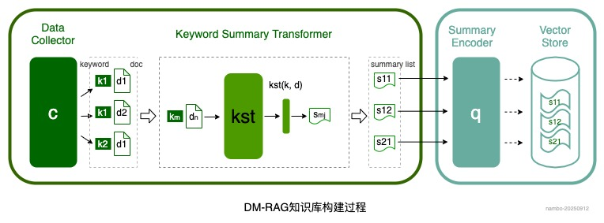
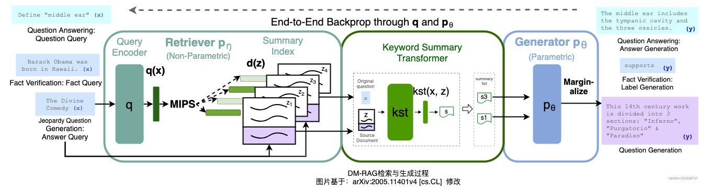
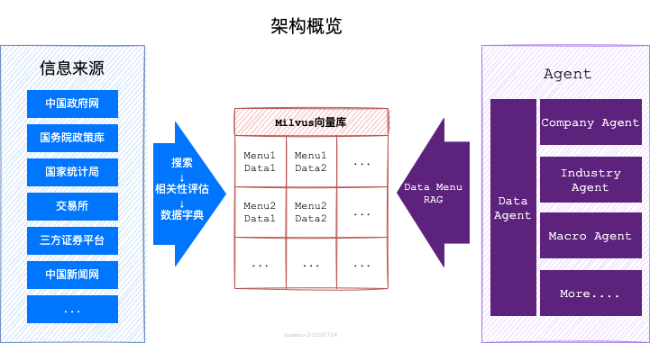
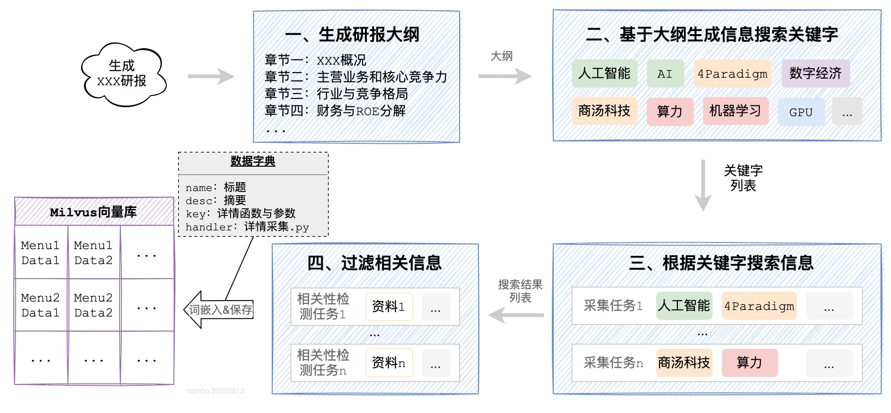
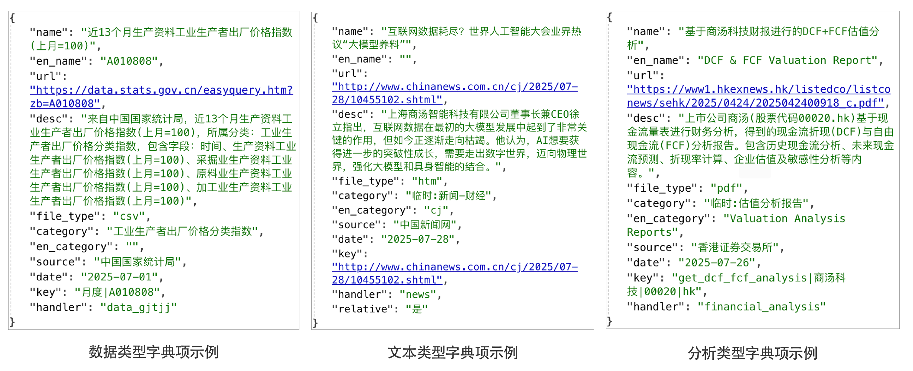
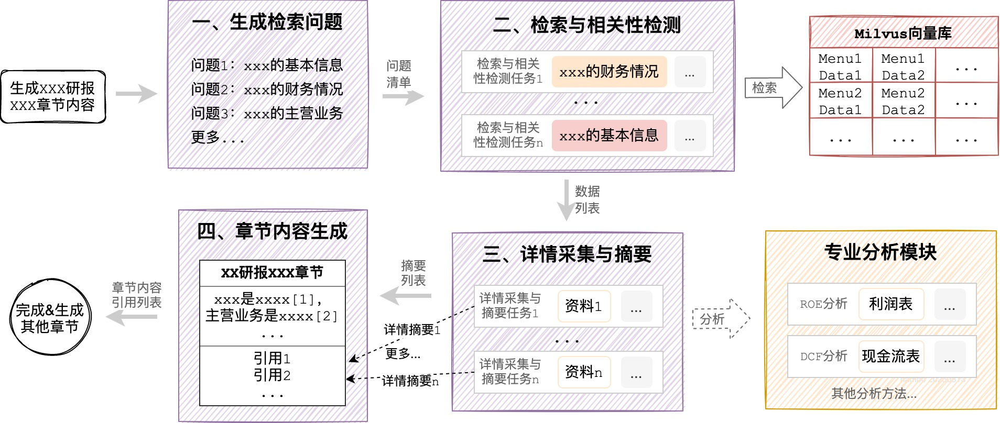
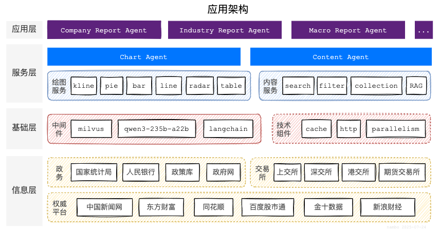
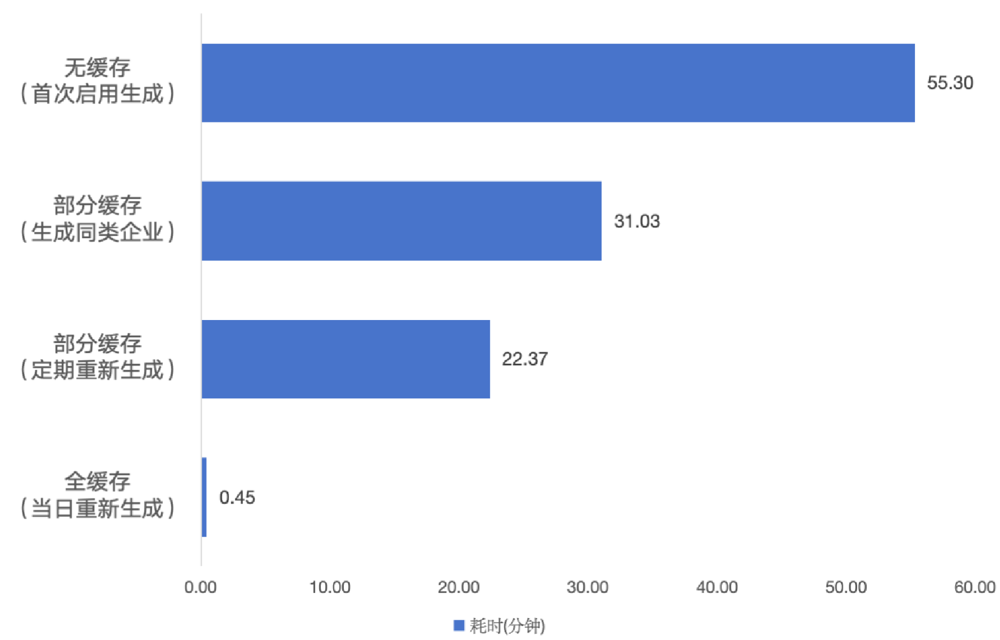
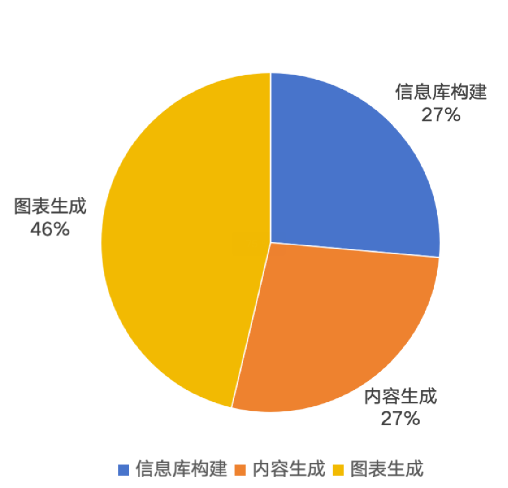
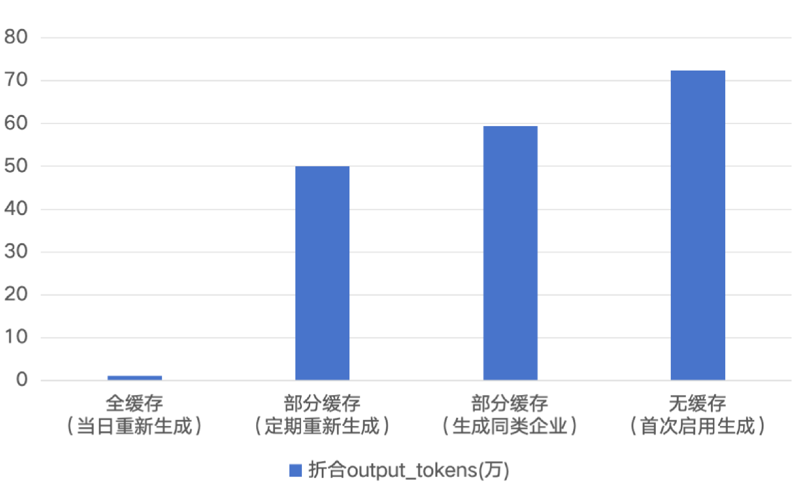

# 基于Data Menu RAG的金融多模态报告生成智能体

这是天池比赛AFAC2025大赛三等奖参赛作品。

比赛信息详见： <a href="https://tianchi.aliyun.com/competition/entrance/532354/information" target="_blank">AFAC2025挑战组-赛题四：智能体赋能的金融多模态报告自动化生成</a>

代码已开源，详见：[Menu RAG](https://github.com/nambo/menu-rag)

参赛队伍：`队伍名字不能为空`                                                 作者：nambo                                             时间：2025-09-01

## 一、引言

近些年，随着人工智能相关技术的突飞猛进，金融科技正经历前所未有的变革。金融研究报告（研报）因其专业性高、涉及内容广泛，一直金融领域的核心产出。随着“大模型”的日益强大，以及相关配套生态的逐渐完善，构建基于大模型的Agent，成为大模型应用的主流方向。

本方案是“2025金融智能创新大赛”的参赛项目，目标是基于大模型及Agent相关技术，构建自动化智能体，完成研报的信息收集、内容生成、图表绘制等工作，自动生成金融研报。目前已经完成基础架构设计和MVP开发，基于MVP版本能够完成数万字的个股、行业、宏观研报的编制工作，在上述创新大赛相关赛题中，荣获三等奖。

该方案中设计的智能体架构，具备较好的生成效率及灵活的拓展能力。除了赛题指定的三个场景以外，通过新数据引入和简单的提示词调整，即可完成新场景研报智能体构建，在金融研报领域具备较好的应用前景。

## 二、架构方案

### 2.1 Data Menu RAG介绍

本方案创新性的提出并使用了Data Menu RAG（简称DM-RAG），这是一种新型RAG架构，它在传统RAG的的两个关键阶段进行改进，解决了传统RAG存在的信息损失、多源信息整合、实时性等方面的局限性，相较于传统RAG方案，主要改进点如下：

1. **知识库构建阶段**：与传统RAG直接**获取原始文档进行切割分块**不同，DM-RAG的知识库构建过程，采用了一种**关键字动态知识摘要**的方法。

大致过程为：`关键字生成` → `搜索` → `信息摘要` → `字典构建` → `向量存储`。
这样做的优势在于：
    - **无切割**：不会对文档进行分块，能够最大程度保障信息的完整性，有效的避免信息损失、主体紊乱、信息泛滥等问题；
    - **多模态**：借助大模型的多模态能力，可以有效的实现对表格、图片等非文本数据处理和引用；
    - **实时性**：搜索结果通常包含摘要，往往仅需搜索无需获取详情，大幅减少了网络请求次数与耗时，提升知识库构建的实时性。

2. **生成阶段**：传统RAG方案是基于检索到的文档块和输入问题生成回答，而DM-RAG采用的是**动态知识摘要融合**策略。
   
   大致过程为：`问题衍生` → `并行检索` → `相关性检测` → `详情获取与摘要生成` → `生成回答`。
   这么做的好处包括：
    - **语义完整**：通过知识摘要，而不是文档分块，确保引用的信息语义完整；
    - **消除语义鸿沟**：通过问题衍生拓展问题语义，通过多角度知识摘要拓展数据语义，再将两者相结合，可以有效的避免语义鸿沟；
    - **避免噪声**：通过相关性检测和知识摘要，可以过滤掉绝大部分噪声干扰。

关于DM-RAG的详细介绍，你可以阅读这篇文章：[Data Menu RAG: 一种基于动态知识摘要的新型检索增强生成框架](https://github.com/nambo/menu-rag/DM_RAG.md)

### 2.2 架构设计

在金融研报这类深度研究场景，为了保障内容丰富度和信息全面性，往往需要整合数以千计资料和数据，同时还涉及对特定数据的专业建模分析。目前主流的方案是基于RAG技术，将原始资料/数据根据语义进行分割，创建向量索引后分块存储，然后基于特定问题进行向量检索到信息块，最后再做归纳汇总。

这种方案不适用于**DeepResearcher**场景，主要问题在于文档的采集与分割过程，不仅会消耗大量计算资源和时间，还会存在不可控的信息损失，导致最终生成效率很低、效果较差。因此，本方案创新性的采用了“Data Menu RAG”技术实现，如下图：

过程一：**知识库构建**

信息搜索、采集与知识库构建过程如下：

1. **生成研报大纲**：基于问题生成研报的所有章节标题及内容提示；
2. **生成信息搜索关键字**：根据研报的大纲，生成需要在互联网进行信息搜索的关键字；
3. **信息搜索**：使用关键字，并行在互联网搜索信息；
4. **相关性检测与字典构建**：并行检测搜索到的结果与原始问题、大纲的相关性，过滤无关信息，并获取摘要转换为数据字典结构；
5. **向量存储**：将字典内容向量化，并构建元数据，存储到向量库中。

知识库中保存了如下的数据：

过程二：**检索与生成**

在完成资料库构建后，将基于大纲逐一生成每个章节的内容，内容生成过程如下：

1. **问题衍生**：基于章节的内容，衍生出多个待检索的问题；
2. **检索与相关性检测**：基于生成的问题，并行检索，并检测过滤与章节无关结果；
3. **详情采集与摘要**：根据检索到的相关字典项，采集对应的详情，并生成与章节内容相关的摘要；
   - 如果是分析类型字典，还会调用对应的专业分析函数，生成专业分析报告；
4. **章节内容生成**：根据章节内容提示，结合生成的摘要清单，融合生成章节内容并标注引用。

**应用架构**

基于上述Data Menu RAG的基本思想，最终构建了多层级的多Agent架构，如下图所示：

从下往上共分为4个层级，分别是：

- **信息层**：采集统计局、人行、国务院、交易所等官方权威平台数据，为研报生成提供高质量数据支撑；
- **基础层**：采用最新的高性能组件，为高效率生成提供技术保障；
- **服务层**：采用MCP协议，构建了绘图、数据（或称为内容）两大基础Agent；
- **应用层**：可以根据使用场景，通过简单的提示词调整，灵活配置不同的Agent。

## 三、创新点

1. **基于数据字典的增强检索生成（Data Menu RAG）技术**
   创新的提出“基于数据字典的增强检索”技术，解决了传统RAG技术，在公开信息研报场景，存在的速度慢、资源消耗高、信息损失等问题，研报生成效率和质量大幅提升。
2. **多级缓存与“断点重试”**
   免费数据源稳定性较差，在大模型会话、数据源获取等关键点设置了多层级的缓存。出现异常时，会自动清理异常缓存，回滚至最近成功点重新继续执行，确保100%成功生成研报，且单篇研报最低仅需消耗30万Token左右。
3. **并行生成**
   在内容数据采集、图表绘制等耗时大的节点，实现了多任务并行生成。在调高并行度且命中大量缓存的情况下，最快10分钟左右可完成研报生成。
4. **数据接入**
   开发了一套数据接入规范，按照约定的数据字典结构，实现2个标准函数（出入参格式、函数名），即可快速接入新的数据源，用于研报生成。
5. **场景拓展**
   采用多层agent架构，服务层Agent已封装通用基础能力，通过应用层Agent简单的提示词调整，即可灵活、便捷的实现新场景拓展。

## 四、应用成效

- **研报质量**：凭借该方案构建mvp版本生成的研报，在AFAC2025比赛中，获得了三等奖；

- **生成速度**：最快10min即可生成一篇研报，进行进一步优化，有希望实现秒级的万字研报生成。不同场景生成速度及不同阶段耗时如下：

  
  

- **资源消耗**：最少只需要30wtoken即可生成一篇。不同场景及不同阶段消耗token如下：

  
  

## 五、未来展望

Data Menu RAG相较于传统RAG方案，其**信息损失**、**多源信息整合**、**实时性**有大幅的改进，特别适合以下场景：

#### 5.1 复杂问题求解

当问题涉及多领域或需要综合多种数据源时，DM-RAG的表现会明显优于传统RAG，例如：

- **综合调研报告**：从多个角度分析某个行业、产品等的市场调用报告；
- **方案对比选型**：从不同维度，分析对比多种方案的优劣势的决策支持场景；
- **数据分析报告**：从统计、趋势、影响等多个维度，分析数据并给出指导性意见的数据分析报告。

#### 5.2 信息实时变化的领域

在知识更新频繁，对信息时效性要求高的领域，DM-RAG可以提供更好的时效性，例如：

- **实时资讯整合**：新闻事件、市场动态等实时性要求高的场景；
- **新型技术研究**：对于刚刚兴起或处于快速发展阶段的技术，如：人工智能、区块链等，进行深度研究；
- **政策规定解读**：经常变动的法律法规、政策文件及内部规定的解读。

#### 5.3 准确性要求高的场景

对于信息准确性要求极高的场景中，DM-RAG通过**动态知识摘要融合**，可以确保信息的完整性和准确性，例如：

- **医疗诊断支持**：症状分析、药物的相互作用等医疗健康分析；
- **金融投资领域**：投资价值、风险评估、市场分析等金融应用；
- **学术研究辅助**：文献综述、学术思路生成等学术研究场景。

> [!NOTE]
>
> 如需转载，可以通过邮件联系我。nambo@foxmail.com

